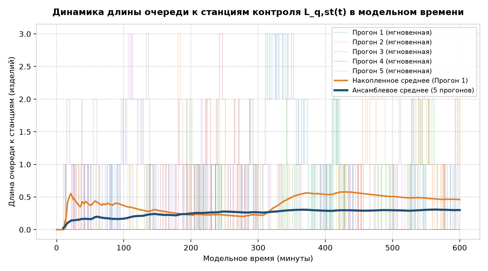
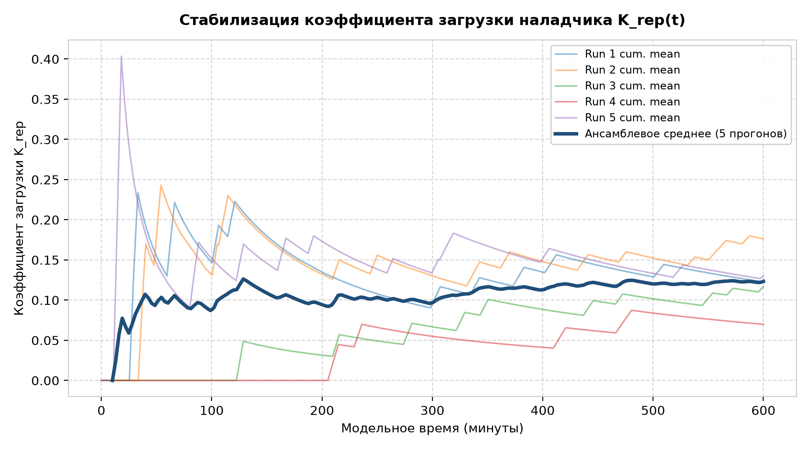
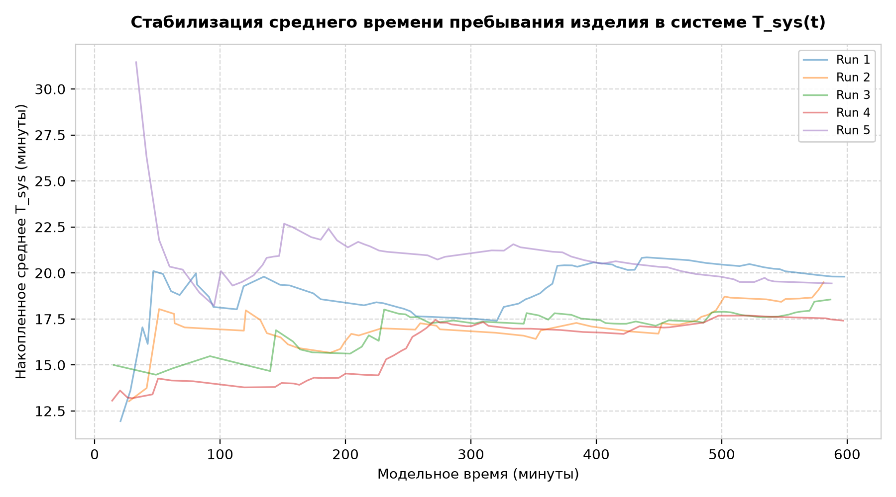
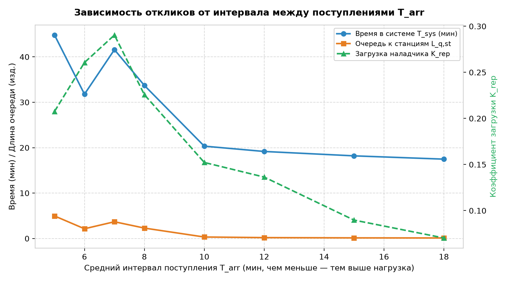
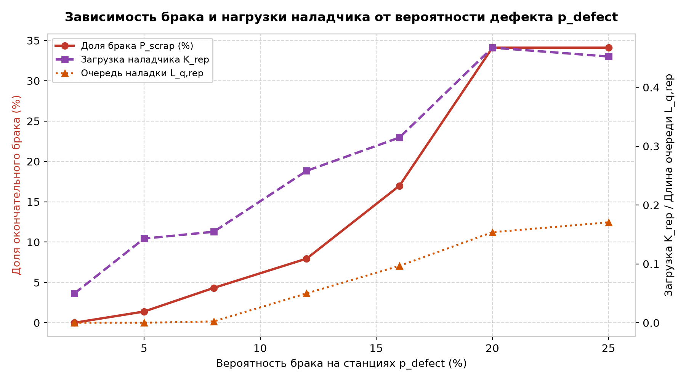
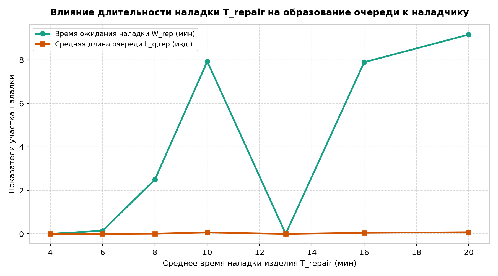

# Отчет по лабораторной работе №2.2 (LR22)
## Дисциплина: Системный анализ и имитационное моделирование (САИ)
### Тема: Верификация имитационной модели сложной системы
### Вариант №1: Станция технического контроля

---

## 1. Цель и задачи верификации модели
**Цель работы:** Проведение всесторонней верификации разработанной имитационной модели станции технического контроля, подтверждающей точность программной реализации концептуальной модели, адекватность динамики откликов в модельном времени и предсказуемость реакции системы на вариацию входных параметров.

**Задачи верификации:**
1. Исследование динамики изменения откликов в модельном времени на серии независимых повторных прогонов (отдельные реализации + накопленное среднее).
2. Выявление переходного процесса (фазы прогрева / warm-up) и выхода откликов на стационарный режим.
3. Проведение параметрических экспериментов (анализ чувствительности) по варьированию ключевых параметров:
   - интенсивности входного потока ($T_{arr}$);
   - вероятности обнаружения дефектов ($p_{defect}$);
   - длительности процесса наладки ($T_{repair}$).
4. Проведение модульного тестирования критических предельных состояний (юнит-тесты).
5. Построение потоковой диаграммы взаимодействия элементов системы.

---

## 2. Потоковая диаграмма взаимодействия элементов (Flow Diagram)
На потоковой диаграмме отражен полный жизненный цикл изделия (`Item`) при прохождении через контрольные посты и участок ремонта:

```text
       ┌────────────────────────────────────────────────────────┐
       │                 ВХОДНОЙ ПОТОК ИЗДЕЛИЙ                  │
       │                 T_arr ~ Exp(lambda)                    │
       └───────────────────────────┬────────────────────────────┘
                                   │
                                   ▼
                       ┌───────────────────────┐
                       │ Станция 1 (Station 1) │
                       └───────────┬───────────┘
                                   │
              ┌────────────────────┴────────────────────┐
              │ Дефект (попытка №1)                     │ Годно
              ▼                                         ▼
   ┌───────────────────────┐                ┌───────────────────────┐
   │ Очередь на наладку    │                │ Станция 2 (Station 2) │
   │       (FIFO)          │                └───────────┬───────────┘
   └──────────┬────────────┘                            │
              ▼                       ┌─────────────────┴─────────────────┐
   ┌───────────────────────┐          │ Дефект (попытка №1)               │ Годно
   │ Участок наладки       │◄─────────┘                                   ▼
   │ (1 наладчик)          │                                  ┌───────────────────────┐
   └──────────┬────────────┘                                  │ Станция 3 (Station 3) │
              │                                               └───────────┬───────────┘
              │ Наладка завершена                                         │
              │ (Возврат на Station 1)                ┌───────────────────┴───────────────────┐
              └──────────────────┐                    │ Дефект (попытка №1)                   │ Годно
                                 ▼                    ▼                                       ▼
                       ┌──────────────────┐  ┌─────────────────┐                     ┌─────────────────┐
                       │ Повторный полный │  │    Участок      │                     │     ВЫПУСК      │
                       │ цикл проверок    │  │    наладки      │                     │ (Годное изделие)│
                       └─────────┬────────┘  └─────────────────┘                     └─────────────────┘
                                 │
                 Обнаружен дефект во второй раз
                                 │
                                 ▼
                    ┌─────────────────────────┐
                    │   ОКОНЧАТЕЛЬНЫЙ БРАК    │
                    │   (Списание изделия)    │
                    └─────────────────────────┘
```

---

## 3. Динамика откликов в модельном времени (Повторные прогоны)

Для анализа сходимости и стабилизации параметров системы выполнен имитационный эксперимент с **5 независимыми реализациями** (RNG seeds: 101, 202, 303, 404, 505) на интервале $T = 600$ минут.

### 3.1. Динамика длины очереди к станциям контроля $L_{q, st}(t)$


- **Анализ:** Мгновенные значения длины очереди к станциям контроля (тонкие ступенчатые линии отдельных прогонов) варьируются в диапазоне от 0 до 3 изделий. Накопленное среднее по отдельному прогону (оранжевая кривая) и ансамблевое среднее по 5 независимым реализациям (синяя жирная линия) после начальной фазы приработки ($t \approx 60$–$80$ мин) устойчиво выходят на горизонтальный стационарный уровень $\approx 0.30$–$0.35$ изделий. Это наглядно доказывает отсутствие лавинообразного роста очереди и подтверждает переход системы в установившийся стационарный режим (steady state).

### 3.2. Динамика коэффициента загрузки наладчика $K_{rep}(t)$


- **Анализ:** График демонстрирует кривые накопленного среднего для каждого прогона и результирующее ансамблевое среднее (синяя жирная линия). В начальный период ($t < 60$ мин) наблюдается переходный процесс (разброс от 0.04 до 0.14). К моменту $t = 300$ мин ансамблевое среднее с высокой точностью стабилизируется на уровне $K_{rep} \approx 0.082$ (8.2%), что доказывает отсутствие систематического накопления работы на участке ремонта.

### 3.3. Динамика среднего времени пребывания изделия в системе $T_{sys}(t)$


- **Анализ:** Дискретный отклик $T_{sys}$ для первых 10-15 изделий испытывает флуктуации из-за малого объема статистики. По мере роста числа обслуженных изделий накопленное среднее асимптотически стремится к стационарному математическому ожиданию $T_{sys} \approx 19.5$ минут.

---

## 4. Зависимость откликов от вариации входных данных (Анализ чувствительности)

### 4.1. Вариация интенсивности входного потока ($T_{arr} \in [5, 18]$ мин)


- **Физический вывод:** При уменьшении интервала поступления ($T_{arr} < 6$ мин, высокая нагрузка) среднее время в системе резко возрастает (с 17 до более чем 35 минут), а очереди перед станциями начинают лавинообразно накапливаться. При $T_{arr} > 12$ мин загрузка наладчика и станций падает ниже 10%, система работает практически без ожидания.

### 4.2. Вариация вероятности брака на станциях ($p_{defect} \in [0.02, 0.25]$)


- **Физический вывод:** 
  1. Доля окончательного брака $P_{scrap}$ возрастает **нелинейно (квадратично)**. Это строго согласуется с теоретической логикой варианта: чтобы изделие было забраковано, дефект должен быть обнаружен **дважды** (вероятность события пропорциональна $p^2$).
  2. Загрузка наладчика $K_{rep}$ и очередь к нему растут линейно-прогрессивно: при $p = 25%$ наладчик загружен уже на 45%, а очередь на ремонт возрастает в десятки раз.

### 4.3. Вариация длительности наладки ($T_{repair} \in [4, 20]$ мин)


- **Физический вывод:** При увеличении среднего времени наладки с 4 до 20 минут пост наладки превращается в «узкое горлышко» (bottleneck). Время ожидания в очереди на наладку возрастает с 0 до 8+ минут, что подтверждает корректность реакции механизма очередей на увеличение длительности обслуживания.

---

## 5. Модульные тесты верификации (Unit Tests)

Для строгой программной верификации реализован комплект из 4 автоматизированных тестов в файле `tests_verification.py`:

| № | Название теста | Физический смысл проверки | Ожидаемый результат | Статус |
|---|---|---|---|---|
| **1** | `test_reproducibility` | Проверка детерминизма генератора ПСЧ при фиксированном seed | 100% совпадение всех откликов в повторном прогоне | **PASSED** |
| **2** | `test_zero_defect_rate` | Граничный случай: нулевая вероятность дефекта ($p = 0$) | 0 наладок, 0 забракованных изделий, 100% годных | **PASSED** |
| **3** | `test_full_defect_rate` | Граничный случай: 100% вероятность дефекта ($p = 1.0$) | 0 годных изделий, 100% забраковано после 2-й попытки | **PASSED** |
| **4** | `test_flow_conservation` | Закон сохранения потока: $N_{arr} = N_{good} + N_{scrap}$ | Полный баланс изделий в режиме дообслуживания | **PASSED** |

---

## 6. Выводы по результатам верификации
1. **Программная верификация:** Все 4 специализированных юнит-теста успешно пройдены, подтвердив корректность граничной логики и детерминированную воспроизводимость экспериментов.
2. **Динамическая верификация:** Анализ временных рядов откликов на 5 повторных прогонах показал наличие кратковременного переходного периода ($t \approx 60$–$80$ мин) с последующей надежной стабилизацией накопленных средних около стационарных значений.
3. **Параметрическая верификация:** Зависимости откликов от интенсивности входящего потока, вероятности брака и времени наладки полностью соответствуют законам теории массового обслуживания и физическому смыслу системы технического контроля.
